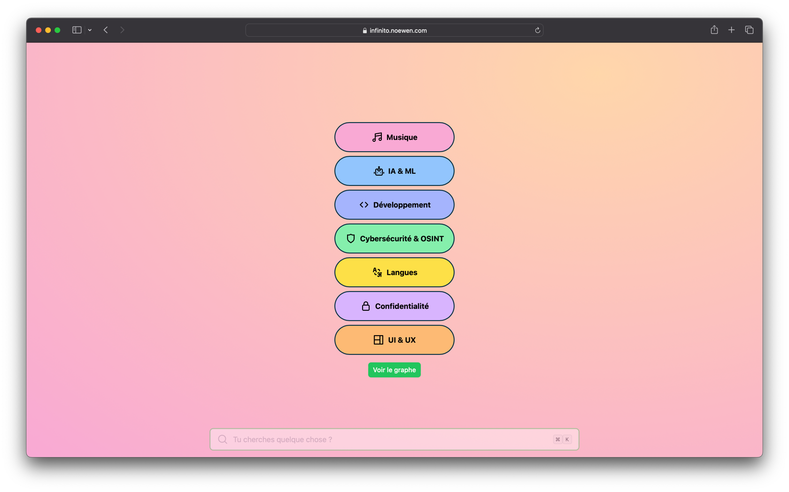

<h1 align="center">
  <br>
  <a href="https://infinito.noewen.com/"></a>
  <br>
  Infinito
  <br>
</h1>

<h4 align="center">Une PWA réalisée par <a href="https://github.com/kernoeb" target="_blank">@kernoeb</a>.</h4>

<hr>



## Setup

Make sure to install the dependencies:

```bash
pnpm install
```

## Development Server

Start the development server on http://localhost:3000

```bash
pnpm run dev
```

## Production

Build the application for production:

```bash
pnpm run build
```

Locally preview production build:

```bash
pnpm run preview
```
